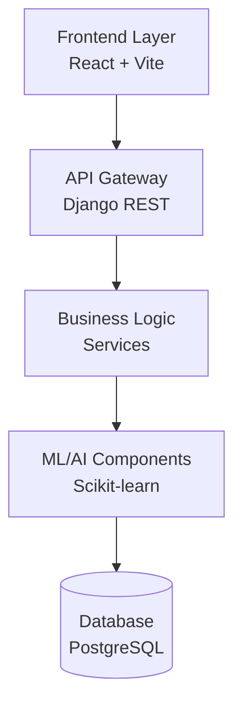
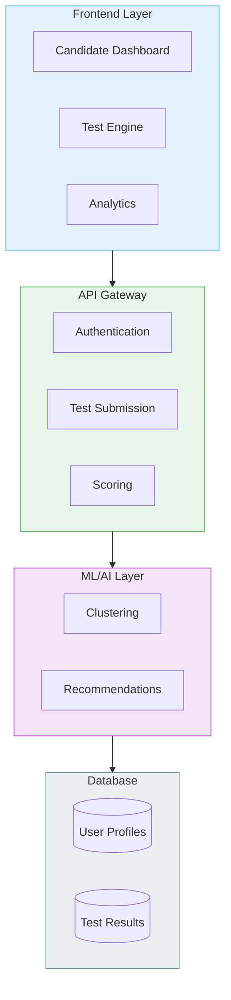

# Quick Start Guide: Creating JobGate Diagrams

This guide provides the fastest way to create professional diagrams for your internship showcase.

---

## Option 1: Use Figma (Recommended - Most Professional)

### Why Figma?
✅ Free for personal use  
✅ Professional results  
✅ Easy to learn  
✅ Collaborative  
✅ Export to PNG/SVG  

### Steps:

1. **Create Account:**
   - Go to https://figma.com
   - Sign up for free account

2. **Create New File:**
   - Click "New Design File"
   - Set canvas to 1600 × 1200px

3. **Use Shapes & Text:**
   - Press `R` for rectangle
   - Press `T` for text
   - Press `L` for line/arrow

4. **Follow Specifications:**
   - Open `DIAGRAM_SPECIFICATIONS.md`
   - Copy colors, fonts, and layout
   - Use the detailed descriptions

5. **Export:**
   - Select all elements
   - File → Export → PNG (300 DPI)
   - Save as `jobgate_system_architecture.png`

### Figma Templates (Search in Community):
- "System Architecture Diagram"
- "User Journey Map"
- "Process Flow Diagram"

---

## Option 2: Use Mermaid (Fastest - Code-Based)

### Why Mermaid?
✅ No design skills needed  
✅ Code-based (version control friendly)  
✅ Quick to create  
✅ Easy to update  

### Steps:

1. **Open Mermaid Live Editor:**
   - Go to https://mermaid.live/

2. **Copy Code:**
   - Open `MERMAID_DIAGRAMS.md`
   - Copy the diagram code you want

3. **Paste & Edit:**
   - Paste into Mermaid Live Editor
   - Customize text and colors
   - Preview in real-time

4. **Export:**
   - Click "Actions" → "PNG"
   - Download high-resolution image

### Example - System Architecture:


---

## Option 3: Use Lucidchart (Easiest - Drag & Drop)

### Why Lucidchart?
✅ Intuitive drag-and-drop  
✅ Professional templates  
✅ Auto-layout features  
✅ Free tier available  

### Steps:

1. **Create Account:**
   - Go to https://lucidchart.com
   - Sign up for free account (3 documents free)

2. **Choose Template:**
   - Click "Create New"
   - Search "System Architecture" or "User Journey"
   - Select template

3. **Customize:**
   - Drag and drop shapes
   - Edit text
   - Change colors to match specifications

4. **Export:**
   - File → Download → PNG
   - Select "High Quality" (300 DPI)

---

## Option 4: Use Canva (Simplest - Pre-made Templates)

### Why Canva?
✅ Super easy to use  
✅ Beautiful templates  
✅ No learning curve  
✅ Free tier  

### Steps:

1. **Create Account:**
   - Go to https://canva.com
   - Sign up for free

2. **Search Templates:**
   - Search "Process Flow" or "System Diagram"
   - Choose a template

3. **Customize:**
   - Replace text with your content
   - Change colors to match brand
   - Add icons from Canva library

4. **Download:**
   - Click "Share" → "Download"
   - Select PNG (high quality)

---

## Quick Comparison Table

| Tool | Difficulty | Time | Quality | Cost | Best For |
|------|-----------|------|---------|------|----------|
| **Figma** | Medium | 2-3 hours | ⭐⭐⭐⭐⭐ | Free | Professional results |
| **Mermaid** | Easy | 30 mins | ⭐⭐⭐⭐ | Free | Quick diagrams |
| **Lucidchart** | Easy | 1-2 hours | ⭐⭐⭐⭐⭐ | Free tier | Drag-and-drop |
| **Canva** | Very Easy | 30 mins | ⭐⭐⭐ | Free | Quick & simple |
| **Draw.io** | Medium | 1-2 hours | ⭐⭐⭐⭐ | Free | Technical diagrams |

---

## Recommended Workflow

### For System Architecture Diagram:

**Option A: Professional (2-3 hours)**
1. Use Figma
2. Follow `DIAGRAM_SPECIFICATIONS.md` exactly
3. Export at 300 DPI
4. Result: Publication-quality diagram

**Option B: Quick (30 minutes)**
1. Use Mermaid Live Editor
2. Copy code from `MERMAID_DIAGRAMS.md`
3. Customize colors and text
4. Export PNG
5. Result: Clean, professional diagram

### For Candidate Journey Workflow:

**Option A: Professional (2-3 hours)**
1. Use Lucidchart
2. Start with "User Journey" template
3. Follow color scheme from specifications
4. Export high-quality PNG
5. Result: Beautiful, polished diagram

**Option B: Quick (30 minutes)**
1. Use Mermaid Live Editor
2. Copy workflow code from `MERMAID_DIAGRAMS.md`
3. Adjust step descriptions
4. Export PNG
5. Result: Clear, functional diagram

---

## Color Codes (Copy-Paste Ready)

### For System Architecture:
```
Frontend Layer: #E3F2FD (background), #2196F3 (border)
API Gateway: #E8F5E9 (background), #4CAF50 (border)
Business Logic: #FFF3E0 (background), #FF9800 (border)
ML/AI Layer: #F3E5F5 (background), #9C27B0 (border)
Data Layer: #ECEFF1 (background), #607D8B (border)
```

### For Candidate Journey:
```
Step 1 (Registration): #4CAF50
Step 2 (Profile): #2196F3
Step 3 (Tests): #FF9800
Step 4 (Scoring): #9C27B0
Step 5 (Employability): #E91E63
Step 6 (Clustering): #00BCD4
Step 7 (Recommendations): #673AB7
Step 8 (Dashboard): #FF5722
```

---

## Icons & Emojis (Copy-Paste Ready)

### System Architecture:
- Frontend: 🎨 📱 💻
- API: 🔌 🔗 ⚡
- Business Logic: ⚙️ 🔧 🛠️
- ML/AI: 🤖 🧠 🔬
- Database: 💾 🗄️ 📊

### Candidate Journey:
- Registration: 👤 📝 ✍️
- Profile: 📋 👔 💼
- Tests: ✏️ 📝 🎯
- Scoring: 🎯 📊 📈
- Clustering: 🔬 🧬 🔍
- Recommendations: 💼 🎁 ⭐
- Dashboard: 📈 📊 🎨

---

## Step-by-Step: Mermaid Diagram (5 Minutes)

### 1. Open Mermaid Live Editor
```
https://mermaid.live/
```

### 2. Paste This Code:


### 3. Click "Actions" → "PNG"

### 4. Done! ✅

---

## Step-by-Step: Figma Diagram (30 Minutes)

### 1. Setup (5 minutes)
- Create Figma account
- New design file
- Set canvas: 1200 × 1400px

### 2. Create Layers (15 minutes)
- Draw 5 rectangles (one per layer)
- Height: 180px each
- Width: Full canvas width
- Spacing: 20px between layers

### 3. Add Content (5 minutes)
- Add text to each layer
- Use colors from specifications
- Add component boxes inside layers

### 4. Add Arrows (3 minutes)
- Use line tool (L)
- Add arrowheads
- Label each arrow

### 5. Export (2 minutes)
- Select all
- Export → PNG → 300 DPI
- Download

---

## Common Mistakes to Avoid

❌ **Don't:**
- Use too many colors (stick to the palette)
- Make text too small (minimum 10pt)
- Overcrowd the diagram
- Use low-resolution exports
- Forget to align elements

✅ **Do:**
- Use consistent spacing
- Keep text readable
- Use white space effectively
- Export at high resolution
- Test at different sizes

---

## Need Help?

### Figma Tutorials:
- YouTube: "Figma Tutorial for Beginners"
- Figma Help Center: https://help.figma.com

### Mermaid Documentation:
- Official Docs: https://mermaid.js.org/
- Examples: https://mermaid.js.org/syntax/examples.html

### Design Inspiration:
- Dribbble: Search "system architecture"
- Behance: Search "user journey diagram"

---

## Time Estimates

### If you have 3 hours:
✅ Use Figma for both diagrams
✅ Follow specifications exactly
✅ Result: Professional, publication-quality

### If you have 1 hour:
✅ Use Mermaid for architecture
✅ Use Lucidchart for journey
✅ Result: Clean, professional

### If you have 30 minutes:
✅ Use Mermaid for both
✅ Copy code from `MERMAID_DIAGRAMS.md`
✅ Result: Functional, clear

---

## Final Checklist

Before adding diagrams to your PDF:

- [ ] Diagrams are high resolution (300 DPI minimum)
- [ ] Text is readable at PDF size
- [ ] Colors match the specifications
- [ ] All elements are aligned
- [ ] Arrows are labeled
- [ ] File size is reasonable (<2MB per diagram)
- [ ] Exported as PNG or SVG
- [ ] Tested in PDF viewer

---

## Quick Links

- **Mermaid Live Editor:** https://mermaid.live/
- **Figma:** https://figma.com
- **Lucidchart:** https://lucidchart.com
- **Canva:** https://canva.com
- **Draw.io:** https://app.diagrams.net/

---

*Choose the tool that matches your time and skill level. Even the "quick" options will produce professional-looking diagrams suitable for your LinkedIn showcase!*
