# JobGate Platform - Mermaid Diagrams

This file contains Mermaid diagram code that can be rendered in Markdown viewers, GitHub, or converted to images.

---

## Diagram 1: System Architecture (Layered View)

```mermaid
graph TB
    subgraph Frontend["🎨 Frontend Layer<br/>React + Vite + TailwindCSS + Framer Motion"]
        FE1[📊 Candidate Dashboard]
        FE2[✏️ Test Engine]
        FE3[📈 Analytics & Visualization]
    end
    
    subgraph API["🔌 API Gateway Layer<br/>Django REST Framework"]
        API1[🔐 Authentication API<br/>JWT Auth, User Management]
        API2[📝 Test Submission API<br/>Answer Processing, Validation]
        API3[🎯 Scoring API<br/>Score Calculation, Metrics]
        API4[💼 Recommendation API<br/>Job Matching, Rankings]
    end
    
    subgraph Business["⚙️ Business Logic Layer<br/>Core Application Services"]
        BL1[🔧 Test Engine Service<br/>• Question Management<br/>• Test Session Handling<br/>• Timer & Progress Tracking]
        BL2[📊 Scoring Service<br/>• Score Calculation<br/>• Employability Metrics<br/>• Profile-Based Weighting]
        BL3[🎯 Recommendation Engine<br/>• Job Matching Algorithm<br/>• Candidate Ranking<br/>• Similarity Calculation]
    end
    
    subgraph ML["🤖 ML/AI Components Layer<br/>Scikit-learn • NumPy • Pandas"]
        ML1[🔬 Clustering Algorithms<br/>• K-Means Clustering<br/>• Candidate Segmentation<br/>• Feature Extraction]
        ML2[🤝 Collaborative Filtering<br/>• User-Based Filtering<br/>• Pattern Recognition<br/>• Hiring Success Analysis]
        ML3[🔍 Content-Based Filtering<br/>• Skill Matching<br/>• Requirement Analysis<br/>• Cosine Similarity]
    end
    
    subgraph Data["💾 Data Layer<br/>PostgreSQL Database"]
        DB1[(👤 User Profiles<br/>Skills, Experience, Preferences)]
        DB2[(📋 Test Results<br/>Scores, Sessions, History)]
        DB3[(💼 Job Offers<br/>Requirements, Descriptions)]
        DB4[(📊 Analytics Data<br/>Metrics, Trends, Insights)]
    end
    
    Frontend -->|HTTP/REST API Calls| API
    API -->|Business Logic Calls| Business
    Business -->|ML/AI Processing| ML
    ML -->|Data Persistence & Retrieval| Data
    
    style Frontend fill:#E3F2FD,stroke:#2196F3,stroke-width:3px
    style API fill:#E8F5E9,stroke:#4CAF50,stroke-width:3px
    style Business fill:#FFF3E0,stroke:#FF9800,stroke-width:3px
    style ML fill:#F3E5F5,stroke:#9C27B0,stroke-width:3px
    style Data fill:#ECEFF1,stroke:#607D8B,stroke-width:3px
```



---

## Diagram 2: Candidate Journey Workflow

```mermaid
graph LR
    A[👤 STEP 1<br/>Registration<br/>━━━━━━━━━━<br/>• Create account<br/>• Email verification<br/>• Basic authentication<br/><br/>⏱️ ~2 minutes]
    B[📝 STEP 2<br/>Profile Setup<br/>━━━━━━━━━━<br/>• Personal information<br/>• Skills & experience<br/>• Career preferences<br/><br/>⏱️ ~5 minutes]
    C[✏️ STEP 3<br/>Skills Tests<br/>━━━━━━━━━━<br/>• Cognitive tests 8 types<br/>• Technical assessments<br/>• Situational judgment<br/><br/>⏱️ ~30-45 minutes]
    D[🎯 STEP 4<br/>Scoring & Analysis<br/>━━━━━━━━━━<br/>• Calculate scores<br/>• Performance metrics<br/>• Category aggregation<br/><br/>⏱️ Real-time]
    E[📊 STEP 5<br/>Employability Score<br/>━━━━━━━━━━<br/>• Profile-based weighting<br/>• Multi-dimensional scoring<br/>• 0-100 scale calculation<br/><br/>⏱️ Instant]
    F[🔬 STEP 6<br/>AI Clustering<br/>━━━━━━━━━━<br/>• K-Means algorithm<br/>• Candidate segmentation<br/>• Similarity grouping<br/><br/>⏱️ ~1 second]
    G[💼 STEP 7<br/>Job Matching<br/>━━━━━━━━━━<br/>• AI-powered matching<br/>• Hybrid filtering<br/>• Ranked recommendations<br/><br/>⏱️ Real-time]
    H[📈 STEP 8<br/>Dashboard & Insights<br/>━━━━━━━━━━<br/>• Performance analytics<br/>• XP & level tracking<br/>• Personalized insights<br/><br/>⏱️ Ongoing]
    
    A -->|Account Created| B
    B -->|Profile Complete| C
    C -->|Tests Submitted| D
    D -->|Scores Calculated| E
    E -->|Score Generated| F
    F -->|Cluster Assigned| G
    G -->|Jobs Matched| H
    H -.->|Retake Tests / Improve| C
    
    style A fill:#4CAF50,stroke:#388E3C,stroke-width:3px,color:#fff
    style B fill:#2196F3,stroke:#1976D2,stroke-width:3px,color:#fff
    style C fill:#FF9800,stroke:#F57C00,stroke-width:3px,color:#fff
    style D fill:#9C27B0,stroke:#7B1FA2,stroke-width:3px,color:#fff
    style E fill:#E91E63,stroke:#C2185B,stroke-width:3px,color:#fff
    style F fill:#00BCD4,stroke:#0097A7,stroke-width:3px,color:#fff
    style G fill:#673AB7,stroke:#512DA8,stroke-width:3px,color:#fff
    style H fill:#FF5722,stroke:#E64A19,stroke-width:3px,color:#fff
```



---

## Diagram 3: Data Flow Architecture (Alternative View)


---

## Diagram 4: Recommendation Engine Flow


---

## Diagram 5: Test Submission Flow


---

## Diagram 6: Employability Scoring Algorithm


---

## How to Use These Diagrams

### Rendering Options:

1. **GitHub/GitLab:**
   - Copy the Mermaid code blocks into your README.md
   - They will render automatically

2. **Mermaid Live Editor:**
   - Visit: https://mermaid.live/
   - Paste the code
   - Export as PNG or SVG

3. **VS Code:**
   - Install "Markdown Preview Mermaid Support" extension
   - View in markdown preview

4. **Notion:**
   - Use `/code` block
   - Select "Mermaid" as language
   - Paste the code

5. **Confluence:**
   - Install Mermaid plugin
   - Use Mermaid macro

6. **Command Line:**
   ```bash
   # Install mermaid-cli
   npm install -g @mermaid-js/mermaid-cli
   
   # Generate PNG
   mmdc -i diagram.mmd -o diagram.png -w 1600 -H 900
   ```

### Customization:

- **Colors:** Modify `style` lines at the end of each diagram
- **Layout:** Change `graph TD` (top-down) to `graph LR` (left-right)
- **Icons:** Add emoji or text icons in node labels
- **Spacing:** Add `<br/>` for line breaks in nodes

---

*These Mermaid diagrams provide a quick way to visualize the JobGate architecture and workflows. They can be easily rendered, edited, and exported for your internship showcase.*
