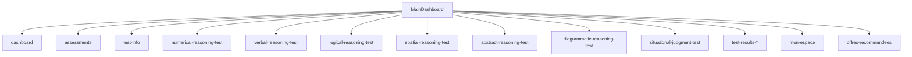
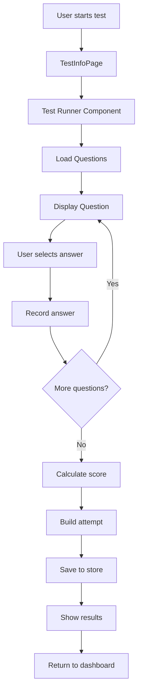
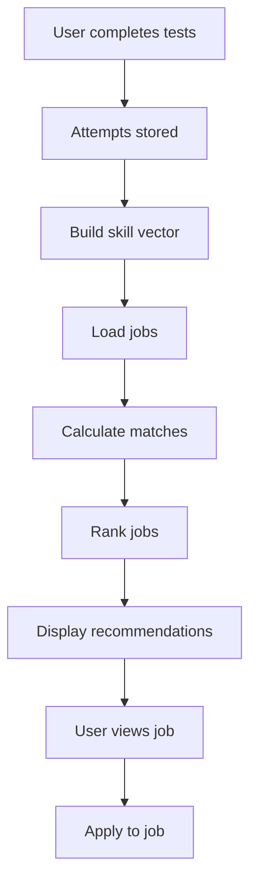
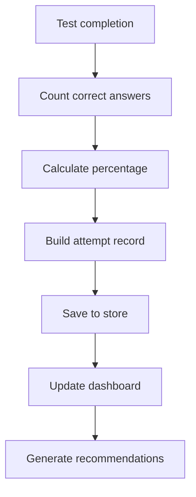

# Project Component & File Map

This is a React + Vite + Tailwind CSS skills assessment platform that provides comprehensive testing capabilities with intelligent job recommendations. The application features a unified test runner system, centralized scoring, and skill-based job matching. To start development, run `npm run dev` in the frontend directory, which will serve the application at `http://localhost:5173`. 

## Table of Contents
1. [Project Overview](#project-overview)
2. [Routing Overview](#routing-overview)
3. [Global Layout (Shell/Chrome)](#global-layout-shellchrome)
4. [Design System & Styles](#design-system--styles)
5. [Internationalization (i18n)](#internationalization-i18n)
6. [Assessments: Pages & Components](#assessments-pages--components)
7. [Rules, Scoring, State](#rules-scoring-state)
8. [Recommendations](#recommendations)
9. [Data Sources & Assets](#data-sources--assets)
10. [Developer Tips](#developer-tips-find--modify-quickly)
11. [Change Log Hooks](#change-log-hooks)
12. [Detailed File Descriptions](#detailed-file-descriptions)
13. [Data Flow Diagrams](#data-flow-diagrams)
14. [Component Hierarchy](#component-hierarchy)

## Routing Overview

The application uses a state-based routing system within `MainDashboard.jsx` rather than React Router for most navigation. The main routing logic is handled through the `activeSection` state.

| Route Path | Page Component | Source File | Notes |
|------------|----------------|-------------|-------|
| `/` | MainDashboard | `src/shared/components/layout/MainDashboard.jsx` | Main entry point with sidebar navigation |
| `dashboard` | DashboardCandidat | `src/features/candidate-dashboard/components/DashboardCandidat.jsx` | Candidate dashboard with stats and recommendations |
| `assessments` | AvailableTests | `src/features/skills-assessment/components/AvailableTests.jsx` | Test selection dashboard |
| `test-info` | TestInfoPage | `src/features/skills-assessment/components/TestInfoPage.jsx` | Test information before starting |
| `numerical-reasoning-test` | NumericalReasoningTest | `src/features/skills-assessment/components/NumericalReasoningTest.jsx` | Numerical test runner |
| `verbal-reasoning-test` | VerbalReasoningTest | `src/features/skills-assessment/components/VerbalReasoningTest.jsx` | Verbal test runner (VRT1-7) |
| `logical-reasoning-test` | LogicalReasoningTest | `src/features/skills-assessment/components/LogicalReasoningTest.jsx` | Logical test runner (LRT1-3) |
| `spatial-reasoning-test` | SpatialReasoningTest | `src/features/skills-assessment/components/SpatialReasoningTest.jsx` | Spatial test runner |
| `abstract-reasoning-test` | AbstractReasoningTest | `src/features/skills-assessment/components/AbstractReasoningTest.jsx` | Abstract test runner |
| `diagrammatic-reasoning-test` | DiagrammaticReasoningTest | `src/features/skills-assessment/components/DiagrammaticReasoningTest.jsx` | Diagrammatic test runner |
| `situational-judgment-test` | SituationalJudgmentTest | `src/features/skills-assessment/components/SituationalJudgmentTest.jsx` | Situational judgment test runner |
| `test-results-*` | TestResultsPage | `src/features/skills-assessment/components/TestResultsPage.jsx` | Results display for any test |
| `mon-espace` | ProfilePage | `src/features/profile/components/ProfilePage.jsx` | User profile management |
| `offres-recommandees` | JobRecommendationsPage | `src/features/job-recommendations/components/JobRecommendationsPage.jsx` | Job recommendations |



## Global Layout (Shell/Chrome)

| Area | Component | Source File | Primary Styles | Data Source |
|------|-----------|-------------|----------------|-------------|
| **Sidebar** | MainDashboard (sidebar section) | `src/shared/components/layout/MainDashboard.jsx` | `sidebar-nav-item`, `skill-category-item` | Static navigation items, skill categories |
| **Top Bar** | MainDashboard (header section) | `src/shared/components/layout/MainDashboard.jsx` | `nav-button`, `text-blue-500` | User dropdown, dark mode toggle |
| **Main Container** | MainDashboard (content area) | `src/shared/components/layout/MainDashboard.jsx` | `h-[calc(100vh-7rem)] overflow-y-auto` | Dynamic content based on `activeSection` |
| **User Dropdown** | MainDashboard (user menu) | `src/shared/components/layout/MainDashboard.jsx` | `absolute right-0 mt-2 w-48` | User profile data, dark mode state |
| **Dark Mode Toggle** | MainDashboard (theme switcher) | `src/shared/components/layout/MainDashboard.jsx` | `flex items-center space-x-2` | `useDarkMode` context |

## Design System & Styles

### Core Style Files
- **Main CSS**: `src/index.css` - Global styles, CSS variables, Tailwind imports
- **Dashboard Design System**: `src/features/candidate-dashboard/styles/dashboard-design-system.css` - Comprehensive design tokens
- **Scroll Styles**: `src/shared/styles/scrollStyles.css` - Custom scroll behavior
- **Profile Styles**: `src/features/profile/styles/profile.css` - Profile-specific styles
- **Tailwind Config**: `tailwind.config.js` - Tailwind configuration

### Core Utility Classes
- **Cards**: `.sa-card`, `.sa-card-header`, `.sa-card-body`
- **Buttons**: `.sa-btn`, `.sa-btn-primary`, `.sa-btn-ghost`, `.sa-btn-secondary`
- **Chips**: `.sa-chip`, `.sa-chip-primary`, `.sa-chip-success`, `.sa-chip-warning`
- **Inputs**: `.sa-input`, `.sa-select`
- **Progress**: `.sa-progress`, `.sa-progress-bar`
- **Avatars**: `.sa-avatar`
- **Stats**: `.sa-stat-item`, `.sa-stat-label`, `.sa-stat-value`
- **Job Cards**: `.sa-job-card`, `.sa-job-header`, `.sa-job-meta`
- **Empty States**: `.sa-empty-state`, `.sa-empty-state-icon`

### CSS Variables (from dashboard-design-system.css)
```css
--sa-primary: #3B82F6;
--sa-success: #10B981;
--sa-warning: #F59E0B;
--sa-danger: #EF4444;
--sa-radius: 16px;
--sa-space-4: 1rem;
```

## Internationalization (i18n)

**Status**: TODO: [No centralized i18n system found] - Text content appears to be hardcoded in French throughout the application. Consider implementing `react-i18next` or similar for internationalization.

**Current Language**: French (hardcoded)
**Language Selector**: Not implemented
**Affected Areas**: All test instructions, UI labels, and content

## Assessments: Pages & Components

### Assessment Dashboard
- **Component**: `AvailableTests`
- **File**: `src/features/skills-assessment/components/AvailableTests.jsx`
- **Controls**: Test search, language selection, test filtering
- **Completed Chips**: Shows completion status from attempt store
- **Navigation**: Routes to test info pages via `onViewTestInfo`

### Test Info Page
- **Component**: `TestInfoPage`
- **File**: `src/features/skills-assessment/components/TestInfoPage.jsx`
- **Props**: `testId` (string)
- **Rule Resolution**: Uses `getRuleFor(testId)` from `testRules.ts`
- **Fields Rendered**: Questions count, time limit, difficulty level
- **CTA Navigation**: Routes to test runner via `onStartTest`

### Unified Test Runner Shell (Anatomy)
- **Component**: `UnifiedTestRunnerShellNew`
- **File**: `src/features/skills-assessment/components/UnifiedTestRunnerShellNew.jsx`
- **Visible Regions**:
  - **Breadcrumb/Back Button**: `FaArrowLeft` icon with "Exit Test" text
  - **Test Title**: Dynamic title from `meta.title`
  - **Timer**: Countdown display with `FaClock` icon
  - **Question Counter**: "Question X of Y" display
  - **Progress Bar**: Visual progress indicator
  - **Content Scroll Container**: Single scrollable area for question content
  - **Controls**: Previous/Next buttons with gating logic
  - **Confirmation Modal**: Pause/exit confirmation dialogs

**Expected Props**:
```javascript
{
  meta: { id, title, timeLimit, totalQuestions },
  currentIndex: number,
  total: number,
  onPrev: () => void,
  onNext: () => void,
  onAbort: () => void,
  onSubmit: () => void,
  isLast: boolean,
  canNext: boolean,
  sectionIndex?: number,
  sectionTotal?: number
}
```

### Runners (by test)

| Test Type | Component | File Path | Layout | Question Source | Answer State | Scoring Method | Special Rules |
|-----------|-----------|-----------|--------|-----------------|--------------|----------------|---------------|
| **Numerical** | NumericalReasoningTest | `src/features/skills-assessment/components/NumericalReasoningTest.jsx` | Vertical stack | `numericalTestSections.js` | `answers` object | `buildAttempt()` | 20Q/20min, rectangular options |
| **Verbal VRT1-3** | VerbalReasoningTest | `src/features/skills-assessment/components/VerbalReasoningTest.jsx` | Vertical stack | `verbalReasoningCategories.js` | `answers` object | `buildAttempt()` | 10Q/20min, A-E options |
| **Verbal VRT4-7** | VerbalReasoningTest | `src/features/skills-assessment/components/VerbalReasoningTest.jsx` | Vertical stack | `verbalReasoningCategories.js` | `answers` object | `buildAttempt()` | 25Q/25-35min, A-E options |
| **Logical LRT1-3** | LogicalReasoningTest | `src/features/skills-assessment/components/LogicalReasoningTest.jsx` | Vertical stack | `logicalTestSections.js` | `answers` object | `buildAttempt()` | 20Q/20min, no sections |
| **Spatial** | SpatialReasoningTest | `src/features/skills-assessment/components/SpatialReasoningTest.jsx` | Vertical stack | `spatialTestSections.js` | `answers` object | `buildAttempt()` | 20Q/20min, 20 from 40 available |
| **Abstract** | AbstractReasoningTest | `src/features/skills-assessment/components/AbstractReasoningTest.jsx` | Vertical stack | `abstractTestSections.js` | `answers` object | `buildAttempt()` | 15Q/30min |
| **Diagrammatic** | DiagrammaticReasoningTest | `src/features/skills-assessment/components/DiagrammaticReasoningTest.jsx` | Vertical stack | `diagrammaticTestSections.js` | `answers` object | `buildAttempt()` | 15Q/30min |
| **Situational** | SituationalJudgmentTest | `src/features/skills-assessment/components/SituationalJudgmentTest.jsx` | Two-column (scenario + options) | `sjtPool.js` | `answers` object | `buildAttempt()` | 20Q/20min, scenario display |

**Intro Images**: Spatial tests include instruction images rendered in the Test Info Page, not in the runner.

### Results Page
- **Component**: `TestResultsPage`
- **File**: `src/features/skills-assessment/components/TestResultsPage.jsx`
- **Fields Displayed**: Score, percentage, performance level, duration
- **Data Source**: `testResults` prop or `location.state`
- **Actions**: "Back to Assessment Dashboard", "Retake Test"
- **Styling**: Uses `getPerformanceLevel()` for color coding

## Rules, Scoring, State

### Test Rules
- **File**: `src/features/skills-assessment/testRules.ts`
- **Functions**: `getRuleFor(testId)`, `buildAttempt()`, `getPrettyTitle()`

| Test ID | Questions | Time (min) | Difficulty |
|---------|-----------|------------|------------|
| numerical | 20 | 20 | mixed |
| vrt1, vrt2, vrt3 | 10 | 20 | mixed |
| vrt4, vrt5 | 25 | 25 | mixed |
| vrt6 | 25 | 30 | mixed |
| vrt7 | 25 | 35 | mixed |
| lrt1, lrt2, lrt3 | 20 | 20 | mixed |
| abstract | 15 | 30 | mixed |
| diagrammatic | 15 | 30 | mixed |
| spatial | 20 | 20 | mixed |
| situational | 20 | 20 | mixed |

### Scoring System
- **File**: `src/features/skills-assessment/lib/scoreUtils.js`
- **Functions**: `computePercentage()`, `buildAttempt()`, `formatDuration()`, `getPerformanceLevel()`
- **Usage**: Called in all test runners on completion

### Attempts Store
- **File**: `src/features/skills-assessment/store/useAttempts.js`
- **Type**: Zustand store with persistence
- **Shape**: `{ test_id, total_questions, correct, percentage, started_at, finished_at, duration_seconds, result }`
- **Functions**: `addAttempt()`, `getAttemptsForTest()`, `hydrate()`, `clearAttempts()`
- **Called From**: All test runners in `handleTestComplete()` and `handleTimeUp()`

### Completion State
- **Determined By**: Presence of attempt record in store
- **Display**: Completion chips in `AvailableTests.jsx`
- **Logic**: `attempts.some(attempt => attempt.test_id === testId)`

## Recommendations

### Skill Vector Builder
- **File**: `src/features/recommendations/skills.js`
- **Functions**: `buildUserSkillVector()`, `getTopSkills()`, `getSkillLevel()`
- **Mapping**: Test types to skills via `TEST_TO_SKILL` object

### Recommendation Engine
- **File**: `src/features/recommendations/engine.js`
- **Functions**: `cosine()`, `jobToVec()`, `scoreJob()`, `recommend()`
- **Algorithm**: Cosine similarity with multi-factor scoring (skills 60%, salary 15%, location 10%, seniority 10%)

### Jobs API & Mocks
- **File**: `src/features/recommendations/jobsApi.js`
- **Mock Data**: `public/mocks/jobs_ma.json` (12 Moroccan job offers)
- **Functions**: `fetchJobs()`, `fetchJobById()`, filtering functions

### Salary Normalization
- **File**: `src/features/recommendations/salary.js`
- **Functions**: `normalizeMAD()`, `formatMAD()`, `getSalaryRange()`
- **Handles**: "12k-18k MAD", "MAD 9000", null, "—", ranges

### Recommendations Hook
- **File**: `src/features/recommendations/useRecommendations.js`
- **Functions**: `useRecommendations()`, `getRecommendations()`, `useUserProfile()`
- **Rendered In**: `JobRecommendations.jsx` component

## Data Sources & Assets

### Question Banks
- **Numerical**: `src/features/skills-assessment/data/numericalTestSections.js`
- **Verbal**: `src/features/skills-assessment/data/verbalReasoningCategories.js`
- **Logical**: `src/features/skills-assessment/data/logicalTestSections.js`
- **Spatial**: `src/features/skills-assessment/data/spatialTestSections.js`
- **Abstract**: `src/features/skills-assessment/data/abstractTestSections.js`
- **Diagrammatic**: `src/features/skills-assessment/data/diagrammaticTestSections.js`
- **Situational**: `src/features/skills-assessment/data/sjtPool.js`

### Static Assets
- **Spatial Images**: `src/assets/images/spatial/questions/` (200 PNG files)
- **Abstract Images**: `src/assets/images/abstract/questions/` (25 PNG files)
- **Diagrammatic Images**: `src/assets/images/diagrammatic/questions/` (21 files)
- **UI Images**: `src/assets/images/ui/` (logos, hero images)
- **Mental Rotation**: `src/assets/images/spatial/mental_rotation/` (28 SVG files)

### Mocks
- **Jobs Data**: `public/mocks/jobs_ma.json` - 12 Moroccan job offers with various salary formats

## Developer Tips (Find & Modify Quickly)

### Common Searches

**Where is the timer?**
```bash
rg -n "timer|Timer" frontend/src
# Found in: UnifiedTestRunnerShellNew.jsx, test runners
```

**Where is the progress bar?**
```bash
rg -n "progress|Progress" frontend/src
# Found in: UnifiedTestRunnerShellNew.jsx, test runners
```

**Where is Next button disabled?**
```bash
rg -n "canNext|disabled.*Next" frontend/src
# Found in: UnifiedTestRunnerShellNew.jsx, test runners
```

**Where are test rules defined?**
```bash
rg -n "getRuleFor|TEST_RULES" frontend/src
# Found in: testRules.ts, test runners
```

**Where are design system classes used?**
```bash
rg -n "sa-card|sa-btn|sa-chip" frontend/src
# Found in: dashboard components, test runners
```

**Where is scoring implemented?**
```bash
rg -n "buildAttempt|addAttempt" frontend/src
# Found in: scoreUtils.js, useAttempts.js, test runners
```

**Where are recommendations rendered?**
```bash
rg -n "useRecommendations|JobRecommendations" frontend/src
# Found in: JobRecommendations.jsx, DashboardCandidat.jsx
```

### Gotchas
- **Don't add second scroll container** - The unified test runner shell provides the main scroll area
- **Test ID normalization** - Use `getRuleFor()` to handle different test ID formats (NRT1 → numerical)
- **Answer state structure** - All tests use `answers[questionId] = { answer, isCorrect }` format
- **Timer expiry** - All tests call `handleTimeUp()` which saves attempt with 'time' reason
- **Results navigation** - Use `setTestStep('results')` to show results page

## Change Log Hooks

### Where to add/edit tokens
- **Design System**: `src/features/candidate-dashboard/styles/dashboard-design-system.css`
- **Global Styles**: `src/index.css`
- **Component Styles**: Individual component files

### Where to add a new test
1. **Rules**: Add entry to `TEST_RULES` in `testRules.ts`
2. **Data**: Create question data file in `src/features/skills-assessment/data/`
3. **Runner**: Create test runner component in `src/features/skills-assessment/components/`
4. **Navigation**: Add route in `MainDashboard.jsx` activeSection logic
5. **Info Page**: Test info will work automatically with `getRuleFor()`

### Where to wire scoring & results
1. **Import**: `buildAttempt` from `scoreUtils.js` and `addAttempt` from `useAttempts.js`
2. **Track Start**: Use `useRef(Date.now())` for `startedAt`
3. **On Complete**: Call `buildAttempt()` and `addAttempt()` in completion handler
4. **On Time Up**: Call same functions in timer expiry handler
5. **Results**: Use `setTestStep('results')` to show `TestResultsPage`

## Detailed File Descriptions

### Core Application Files

#### `src/app/App.jsx`
**Purpose**: Main application entry point and root component
**Size**: 26 lines
**Dependencies**: React, BrowserRouter, DarkModeProvider, MainDashboard, Dashboard, initializeScrollBehavior
**Key Features**:
- Wraps entire app in DarkModeProvider for theme management
- Uses BrowserRouter for client-side routing
- Manages view switching between 'dashboard' and 'candidat-dashboard'
- Initializes scroll behavior on app mount
- Renders either MainDashboard or Dashboard based on currentView state

**Data Flow**:
- `currentView` state determines which main component to render
- `initializeScrollBehavior()` sets up global scroll management
- DarkModeProvider provides theme context to all child components

**Connections**:
- **Imports**: DarkModeContext, MainDashboard, Dashboard, scrollUtils
- **Exports**: Default App component
- **Used By**: main.jsx (entry point)

#### `src/app/main.jsx`
**Purpose**: Vite entry point that renders the React app
**Size**: 8 lines
**Dependencies**: React, ReactDOM, App
**Key Features**:
- Imports App component and renders it to DOM
- Uses React 18's createRoot API
- Sets up strict mode for development

**Data Flow**:
- Renders App component to #root element
- App component handles all further rendering

**Connections**:
- **Imports**: React, ReactDOM, App
- **Used By**: Vite build system
- **Renders**: App component

### Layout & Navigation

#### `src/shared/components/layout/MainDashboard.jsx`
**Purpose**: Main application shell with sidebar navigation and content area
**Size**: 936 lines
**Dependencies**: 50+ imports including Heroicons, all test components, dashboard components, contexts
**Key Features**:
- **Sidebar Navigation**: Complete navigation system with skill categories, test sections, user management
- **State Management**: Manages activeSection, currentTestId, test filters, user dropdown state
- **Dark Mode**: Integrated dark mode toggle with useDarkMode context
- **User Dropdown**: User profile menu with theme switcher and logout
- **Content Router**: Renders different components based on activeSection state
- **Test Navigation**: Handles test info viewing, test starting, and results display
- **Scroll Management**: Prevents body scroll during test sessions

**State Variables**:
- `activeSection`: Current page/section being displayed
- `currentTestId`: ID of currently selected test
- `currentTestFilter`: Filter for test selection
- `showUserDropdown`: Controls user menu visibility
- `testResults`: Results from completed tests

**Key Functions**:
- `handleViewTestInfo(testId)`: Shows test information page
- `handleStartTest(testId)`: Starts a test session
- `handleTestComplete(results)`: Processes test completion and shows results
- `handleRetakeTest(testId)`: Restarts a completed test

**Data Flow**:
- Receives navigation events from sidebar and test components
- Manages test state and routing between different sections
- Passes test data and callbacks to child components
- Handles test completion and results display

**Connections**:
- **Imports**: All test runners, dashboard components, contexts, utilities
- **Exports**: MainDashboard component
- **Used By**: App.jsx
- **Renders**: 20+ different components based on activeSection

### Design System & Styling

#### `src/index.css`
**Purpose**: Global CSS styles and Tailwind configuration
**Size**: 102 lines
**Dependencies**: Tailwind CSS, Google Fonts, custom scroll styles
**Key Features**:
- **Tailwind Imports**: Base, components, and utilities
- **Google Fonts**: Inter font family import
- **CSS Variables**: Primary color palette and custom properties
- **Base Styles**: Global reset, typography, and layout styles
- **Custom Classes**: Assessment-specific utility classes
- **Scroll Styles**: Custom scrollbar styling

**CSS Variables**:
```css
--primary-50: #eff6ff;
--primary-100: #dbeafe;
--primary-500: #3b82f6;
--primary-600: #2563eb;
--primary-700: #1d4ed8;
--primary-900: #1e3a8a;
```

**Data Flow**:
- Applied globally to all components
- Provides consistent styling foundation
- Imports custom scroll styles from shared/styles

**Connections**:
- **Imports**: Tailwind CSS, Google Fonts, scrollStyles.css
- **Used By**: All components via global CSS
- **Extends**: Tailwind with custom utility classes

#### `src/features/candidate-dashboard/styles/dashboard-design-system.css`
**Purpose**: Comprehensive design system for candidate dashboard
**Size**: 521 lines
**Dependencies**: CSS custom properties, Tailwind utilities
**Key Features**:
- **Color Palette**: Complete color system with primary, secondary, success, warning, danger
- **Typography**: Font sizes, weights, and line heights
- **Spacing**: Consistent spacing scale
- **Components**: Pre-built component classes (cards, buttons, chips, etc.)
- **States**: Hover, focus, active, disabled states
- **Animations**: Fade-in, slide, and transition effects

**Core Utility Classes**:
- `.sa-card`: Base card component with padding, border radius, shadow
- `.sa-btn`: Button base with variants (primary, secondary, ghost)
- `.sa-chip`: Small badge component for tags and labels
- `.sa-input`: Form input styling
- `.sa-progress`: Progress bar components
- `.sa-avatar`: User avatar styling
- `.sa-job-card`: Job recommendation card styling

**Data Flow**:
- Imported by dashboard components
- Provides consistent styling across candidate dashboard
- Works with Tailwind CSS for responsive design

**Connections**:
- **Imported By**: DashboardCandidat.jsx, JobRecommendations.jsx, ProfileHeader.jsx
- **Extends**: Global CSS with dashboard-specific utilities
- **Used With**: Tailwind CSS classes

### Context & State Management

#### `src/contexts/DarkModeContext.jsx`
**Purpose**: Global dark mode state management
**Size**: 50+ lines
**Dependencies**: React Context API, localStorage
**Key Features**:
- **Theme State**: Manages current theme (light/dark)
- **Persistence**: Saves theme preference to localStorage
- **Provider**: Wraps entire app with theme context
- **Hook**: useDarkMode hook for easy theme access
- **Toggle**: Function to switch between themes

**State Variables**:
- `isDarkMode`: Boolean indicating dark mode state
- `setIsDarkMode`: Function to toggle theme

**Data Flow**:
- Initializes from localStorage on mount
- Provides theme state to all child components
- Persists changes to localStorage

**Connections**:
- **Imported By**: App.jsx, MainDashboard.jsx, various components
- **Exports**: DarkModeProvider, useDarkMode
- **Used By**: All components that need theme access

#### `src/features/skills-assessment/store/useAttempts.js`
**Purpose**: Zustand store for managing test attempts
**Size**: 30+ lines
**Dependencies**: Zustand, persist middleware
**Key Features**:
- **Attempt Storage**: Stores all test attempts with persistence
- **CRUD Operations**: Add, retrieve, clear attempts
- **Persistence**: Automatically saves to localStorage
- **Filtering**: Get attempts by test ID

**State Shape**:
```javascript
{
  attempts: Attempt[],
  addAttempt: (attempt) => void,
  hydrate: (list) => void,
  clearAttempts: () => void,
  getAttemptsForTest: (testId) => Attempt[]
}
```

**Data Flow**:
- Test runners call addAttempt() on completion
- Dashboard components read attempts for display
- Persistence handled automatically by Zustand

**Connections**:
- **Imported By**: All test runners, dashboard components
- **Exports**: useAttempts store
- **Used By**: NumericalReasoningTest, VerbalReasoningTest, etc.

### Scoring & Rules System

#### `src/features/skills-assessment/lib/scoreUtils.js`
**Purpose**: Centralized scoring utilities and attempt building
**Size**: 44 lines
**Dependencies**: None (pure functions)
**Key Features**:
- **Score Calculation**: computePercentage() for score calculation
- **Attempt Building**: buildAttempt() for standardized attempt records
- **Duration Formatting**: formatDuration() for time display
- **Performance Levels**: getPerformanceLevel() for score categorization
- **Legacy Support**: buildAttemptPayload() and calculateScore() for backward compatibility

**Functions**:
- `computePercentage(correct, total)`: Calculates percentage score
- `buildAttempt(testId, total, correct, startedAt, reason)`: Creates attempt record
- `formatDuration(seconds)`: Formats time duration (e.g., "2m 30s")
- `getPerformanceLevel(percentage)`: Returns performance level with colors
- `buildAttemptPayload()`: Alias for buildAttempt
- `calculateScore()`: Alias for computePercentage

**Data Flow**:
- Called by all test runners on completion
- Creates standardized attempt records
- Used by TestResultsPage for score display

**Connections**:
- **Imported By**: All test runners, TestResultsPage, AttemptsHistory
- **Exports**: All scoring utility functions
- **Used By**: NumericalReasoningTest, VerbalReasoningTest, etc.

#### `src/features/skills-assessment/testRules.ts`
**Purpose**: Centralized test configuration and rules
**Size**: 104 lines
**Dependencies**: TypeScript types
**Key Features**:
- **Test Rules**: Complete configuration for all test types
- **ID Normalization**: Handles different test ID formats
- **Attempt Building**: Helper for creating attempt records
- **Title Generation**: Pretty titles for test display

**Test Rules Configuration**:
```typescript
{
  numerical: { timeLimitMin: 20, totalQuestions: 20, difficultyLabel: 'mixed' },
  vrt1: { timeLimitMin: 20, totalQuestions: 10, difficultyLabel: 'mixed' },
  lrt1: { timeLimitMin: 20, totalQuestions: 20, difficultyLabel: 'mixed' },
  // ... more rules
}
```

**Functions**:
- `getRuleFor(testIdRaw)`: Normalizes test ID and returns rule
- `buildAttempt()`: Creates attempt record (legacy)
- `getPrettyTitle(testId)`: Generates display title for test

**Data Flow**:
- TestInfoPage uses getRuleFor() to display test info
- Test runners use rules for configuration
- Test selection uses getPrettyTitle() for display

**Connections**:
- **Imported By**: TestInfoPage, all test runners, AvailableTests
- **Exports**: TestRule type, TEST_RULES, utility functions
- **Used By**: All test-related components

### Test Runner Components

#### `src/features/skills-assessment/components/NumericalReasoningTest.jsx`
**Purpose**: Numerical reasoning test runner with rectangular answer options
**Size**: 1015 lines
**Dependencies**: React, Framer Motion, Heroicons, scoreUtils, useAttempts, testRules
**Key Features**:
- **Test Execution**: Runs numerical reasoning questions with timer
- **Answer Selection**: Rectangular answer options with checkmark icons
- **Timer Management**: Countdown timer with time-up handling
- **Scoring Integration**: Uses centralized scoring system
- **Navigation**: Previous/Next buttons with gating logic
- **Results Display**: Shows results page on completion

**State Variables**:
- `testStep`: Current step (test, results)
- `currentQuestion`: Current question index (1-based)
- `timeRemaining`: Seconds remaining
- `answers`: User's answer selections
- `testData`: Loaded test questions
- `isPaused`: Pause state
- `startedAt`: Test start timestamp

**Key Functions**:
- `handleAnswerSelect()`: Records answer selection with highlighting
- `handleNext()`: Advances to next question
- `handlePrevious()`: Goes back to previous question
- `handleTestComplete()`: Processes test completion
- `handleTimeUp()`: Handles timer expiry

**Data Flow**:
- Loads questions from numericalTestSections.js
- Tracks answers in local state
- Saves attempt to store on completion
- Shows results page with score

**Connections**:
- **Imports**: scoreUtils, useAttempts, testRules, TestResultsPage
- **Used By**: MainDashboard (routing)
- **Data Sources**: numericalTestSections.js

#### `src/features/skills-assessment/components/VerbalReasoningTest.jsx`
**Purpose**: Verbal reasoning test runner supporting VRT1-7 variants
**Size**: 679 lines
**Dependencies**: React, Framer Motion, Heroicons, scoreUtils, useAttempts, testRules
**Key Features**:
- **Multi-Variant Support**: Handles VRT1-7 with different question counts
- **Answer Options**: A-E option selection with proper formatting
- **Question Loading**: Dynamic question loading based on test ID
- **Scoring**: Integrated with centralized scoring system
- **Timer**: Per-test timer based on rules

**State Variables**:
- `currentQuestion`: Current question index
- `answers`: Answer selections
- `testData`: Loaded questions
- `timeRemaining`: Timer countdown
- `testStep`: Current step

**Key Functions**:
- `loadTestData()`: Loads questions based on test ID
- `handleAnswerSelect()`: Records answer selection
- `handleSubmitTest()`: Processes test completion
- `handleNext()`: Navigation logic

**Data Flow**:
- Loads questions from verbalReasoningCategories.js
- Supports different question counts per VRT variant
- Saves attempt on completion

**Connections**:
- **Imports**: scoreUtils, useAttempts, testRules, verbalReasoningCategories
- **Used By**: MainDashboard (routing)
- **Data Sources**: verbalReasoningCategories.js

#### `src/features/skills-assessment/components/LogicalReasoningTest.jsx`
**Purpose**: Logical reasoning test runner (LRT1-3)
**Size**: 480 lines
**Dependencies**: React, Framer Motion, Heroicons, scoreUtils, useAttempts, testRules
**Key Features**:
- **Simplified Layout**: Clean test interface without extra wrappers
- **Rule Enforcement**: 20 questions, 20 minutes, mixed difficulty
- **Gated Navigation**: Next button disabled until answer selected
- **Scoring Integration**: Uses centralized scoring system
- **Results Display**: Shows TestResultsPage on completion

**State Variables**:
- `currentQuestion`: Current question index
- `answers`: Answer selections
- `questions`: Loaded questions
- `timeRemaining`: Timer countdown
- `testStep`: Current step

**Key Functions**:
- `handleAnswerSelect()`: Records answer with validation
- `handleNextQuestion()`: Navigation with gating
- `handleFinishTest()`: Processes completion
- `handleTimeUp()`: Timer expiry handling

**Data Flow**:
- Loads questions from logicalTestSections.js
- Enforces 20Q/20min rule
- Saves attempt on completion

**Connections**:
- **Imports**: scoreUtils, useAttempts, testRules, TestResultsPage
- **Used By**: MainDashboard (routing)
- **Data Sources**: logicalTestSections.js

#### `src/features/skills-assessment/components/SpatialReasoningTest.jsx`
**Purpose**: Spatial reasoning test runner with image-based questions
**Size**: 500+ lines
**Dependencies**: React, Framer Motion, Heroicons, scoreUtils, useAttempts, testRules
**Key Features**:
- **Image Questions**: Displays spatial reasoning images
- **Question Selection**: Selects 20 questions from 40 available
- **Section Management**: Handles different spatial reasoning sections
- **Scoring**: Integrated with centralized scoring
- **Results**: Shows results page on completion

**State Variables**:
- `currentQuestion`: Current question index
- `answers`: Answer selections
- `questions`: Selected questions (20 from 40)
- `timeRemaining`: Timer countdown
- `testStep`: Current step

**Key Functions**:
- `loadQuestions()`: Selects 20 questions from available pool
- `handleAnswerSelect()`: Records spatial reasoning answers
- `handleFinishTest()`: Processes completion
- `handleTimeUp()`: Timer expiry handling

**Data Flow**:
- Loads questions from spatialTestSections.js
- Selects 20 questions randomly
- Saves attempt on completion

**Connections**:
- **Imports**: scoreUtils, useAttempts, testRules, TestResultsPage
- **Used By**: MainDashboard (routing)
- **Data Sources**: spatialTestSections.js, spatial images

#### `src/features/skills-assessment/components/SituationalJudgmentTest.jsx`
**Purpose**: Situational judgment test with scenario display
**Size**: 400+ lines
**Dependencies**: React, UnifiedTestRunnerShellNew, scoreUtils, useAttempts, sjtPool
**Key Features**:
- **Scenario Display**: Shows scenario prominently above questions
- **Two-Column Layout**: Scenario on top, question/options below
- **Unified Shell**: Uses UnifiedTestRunnerShellNew for consistency
- **Scoring**: Integrated with centralized scoring
- **Results**: Shows results page on completion

**State Variables**:
- `currentQuestion`: Current question index
- `answers`: Answer selections
- `questions`: Loaded SJT questions
- `timeRemaining`: Timer countdown
- `testStep`: Current step

**Key Functions**:
- `loadQuestions()`: Loads SJT questions from pool
- `handleAnswerSelect()`: Records judgment answers
- `handleFinishTest()`: Processes completion
- `handleTimeUp()`: Timer expiry handling

**Data Flow**:
- Loads questions from sjtPool.js
- Displays scenario and question together
- Saves attempt on completion

**Connections**:
- **Imports**: UnifiedTestRunnerShellNew, scoreUtils, useAttempts, sjtPool
- **Used By**: MainDashboard (routing)
- **Data Sources**: sjtPool.js, masterSJTPool.jsonl

### Unified Test Runner Shell

#### `src/features/skills-assessment/components/UnifiedTestRunnerShellNew.jsx`
**Purpose**: Reusable test runner shell with consistent UI
**Size**: 300+ lines
**Dependencies**: React, Framer Motion, Heroicons
**Key Features**:
- **Header**: Test title, question counter, timer display
- **Progress Bar**: Visual progress indicator
- **Navigation**: Previous/Next buttons with gating
- **Modals**: Pause and exit confirmation dialogs
- **Responsive**: Mobile-friendly design
- **Accessibility**: ARIA labels and keyboard navigation

**Props Interface**:
```javascript
{
  meta: { id, title, timeLimit, totalQuestions },
  currentIndex: number,
  total: number,
  onPrev: () => void,
  onNext: () => void,
  onAbort: () => void,
  onSubmit: () => void,
  isLast: boolean,
  canNext: boolean,
  sectionIndex?: number,
  sectionTotal?: number,
  children: ReactNode
}
```

**Key Functions**:
- `handleExit()`: Shows exit confirmation
- `handlePause()`: Shows pause modal
- `handleResume()`: Resumes test
- `handleSubmit()`: Shows submit confirmation

**Data Flow**:
- Receives test metadata and callbacks
- Renders consistent UI for all test types
- Manages modal states and confirmations

**Connections**:
- **Imported By**: SituationalJudgmentTest, other test runners
- **Exports**: UnifiedTestRunnerShellNew component
- **Used By**: All test runners that need consistent UI

### Test Information & Results

#### `src/features/skills-assessment/components/TestInfoPage.jsx`
**Purpose**: Test information display before starting tests
**Size**: 359 lines
**Dependencies**: React, Framer Motion, Heroicons, testRules
**Key Features**:
- **Test Details**: Shows questions count, time limit, difficulty
- **Rule Integration**: Uses getRuleFor() to get test configuration
- **Start Button**: Initiates test session
- **Error Handling**: Shows error for unknown tests
- **Responsive**: Mobile-friendly layout

**Props**:
- `testId`: Test identifier
- `onStartTest`: Callback to start test
- `onBack`: Callback to go back

**Key Functions**:
- `getRuleFor(testId)`: Gets test configuration
- `handleStartTest()`: Calls onStartTest callback
- `handleBack()`: Calls onBack callback

**Data Flow**:
- Receives testId from parent
- Fetches test rules using getRuleFor()
- Displays test information
- Calls callbacks for navigation

**Connections**:
- **Imported By**: MainDashboard, AvailableTests
- **Exports**: TestInfoPage component
- **Data Sources**: testRules.ts

#### `src/features/skills-assessment/components/TestResultsPage.jsx`
**Purpose**: Test results display after completion
**Size**: 300+ lines
**Dependencies**: React, Framer Motion, Heroicons, scoreUtils
**Key Features**:
- **Score Display**: Shows percentage, correct answers, total questions
- **Performance Level**: Color-coded performance indicator
- **Duration**: Test completion time
- **Actions**: Back to dashboard, retake test
- **Responsive**: Mobile-friendly layout

**Props**:
- `testResults`: Test completion data
- `onBackToDashboard`: Callback to return to dashboard
- `onRetakeTest`: Callback to retake test

**Key Functions**:
- `getPerformanceLevel()`: Gets performance level with colors
- `formatDuration()`: Formats time duration
- `handleBackToDashboard()`: Navigation callback
- `handleRetakeTest()`: Retake callback

**Data Flow**:
- Receives test results from parent
- Displays score and performance information
- Calls callbacks for navigation

**Connections**:
- **Imported By**: All test runners
- **Exports**: TestResultsPage component
- **Data Sources**: scoreUtils.js

### Dashboard Components

#### `src/features/candidate-dashboard/components/DashboardCandidat.jsx`
**Purpose**: Main candidate dashboard with stats and recommendations
**Size**: 400+ lines
**Dependencies**: React, Framer Motion, various dashboard components
**Key Features**:
- **Profile Header**: User information and progress
- **Quick Stats**: Test completion statistics
- **Job Recommendations**: Personalized job suggestions
- **Recent Tests**: Test history display
- **Skills Performance**: Skills assessment results
- **Responsive Layout**: Grid-based responsive design

**State Variables**:
- `userData`: User profile information
- `testStats`: Test completion statistics
- `recommendations`: Job recommendations
- `recentTests`: Recent test results

**Key Functions**:
- `loadUserData()`: Loads user profile
- `loadTestStats()`: Loads test statistics
- `loadRecommendations()`: Loads job recommendations
- `handleNavigation()`: Handles navigation to other sections

**Data Flow**:
- Loads user data and statistics
- Displays job recommendations
- Shows recent test results
- Handles navigation to other sections

**Connections**:
- **Imported By**: MainDashboard, App
- **Exports**: DashboardCandidat component
- **Data Sources**: ProfileHeader, JobRecommendations, RecentTests

#### `src/features/candidate-dashboard/components/JobRecommendations.jsx`
**Purpose**: Job recommendations display with intelligent matching
**Size**: 200+ lines
**Dependencies**: React, useRecommendations, engine, salary
**Key Features**:
- **Intelligent Matching**: Skill-based job matching
- **Salary Display**: Normalized salary ranges
- **Match Scores**: Percentage match with explanations
- **Skill Tags**: Relevant skills for each job
- **Loading States**: Loading and error handling
- **Empty States**: Helpful messages when no recommendations

**Hooks Used**:
- `useRecommendations()`: Gets job recommendations
- `useUserProfile()`: Gets user preferences

**Key Functions**:
- `getMatchColor()`: Gets color for match score
- `getTopSkillsFromJob()`: Gets relevant skills
- `getSalaryRange()`: Formats salary display
- `getMatchExplanation()`: Explains match reasons

**Data Flow**:
- Uses recommendation engine to get matches
- Displays job cards with match scores
- Shows skill tags and salary information

**Connections**:
- **Imported By**: DashboardCandidat
- **Exports**: JobRecommendations component
- **Data Sources**: useRecommendations hook, jobs API

### Recommendation System

#### `src/features/recommendations/useRecommendations.js`
**Purpose**: Hook for getting job recommendations
**Size**: 70+ lines
**Dependencies**: React, useAttempts, skills, jobsApi, engine
**Key Features**:
- **Recommendation Logic**: Gets recommendations based on test attempts
- **Loading States**: Handles loading and error states
- **User Profile**: Manages user preferences
- **Job Fetching**: Loads jobs from API or mock data

**Hooks**:
- `useRecommendations(profile, topK)`: Main recommendation hook
- `useUserProfile()`: User preferences hook
- `getRecommendations(profile, topK)`: Async recommendation function

**State Variables**:
- `jobs`: Available job listings
- `loading`: Loading state
- `error`: Error state
- `recommendations`: Computed recommendations
- `userSkills`: User's skill vector

**Data Flow**:
- Loads jobs from API or mock data
- Builds user skill vector from test attempts
- Computes recommendations using engine
- Returns recommendations with loading states

**Connections**:
- **Imported By**: JobRecommendations
- **Exports**: useRecommendations, useUserProfile, getRecommendations
- **Data Sources**: useAttempts, skills, jobsApi, engine

#### `src/features/recommendations/engine.js`
**Purpose**: Recommendation engine with cosine similarity
**Size**: 100+ lines
**Dependencies**: salary normalization
**Key Features**:
- **Cosine Similarity**: Calculates skill similarity between user and jobs
- **Multi-Factor Scoring**: Skills (60%), salary (15%), location (10%), seniority (10%)
- **Job Vectorization**: Converts jobs to skill vectors
- **Recommendation Ranking**: Ranks jobs by match score

**Functions**:
- `cosine(a, b)`: Calculates cosine similarity
- `jobToVec(job)`: Converts job to skill vector
- `scoreJob(userVec, job, profile)`: Scores individual job
- `recommend(userVec, jobs, profile, topK)`: Gets top recommendations
- `getTopSkillsFromJob(job, limit)`: Gets relevant skills
- `getMatchExplanation(parts)`: Explains match reasons

**Data Flow**:
- Takes user skill vector and job list
- Calculates similarity scores
- Ranks jobs by match score
- Returns top recommendations

**Connections**:
- **Imported By**: useRecommendations
- **Exports**: All recommendation functions
- **Data Sources**: salary.js for salary normalization

#### `src/features/recommendations/skills.js`
**Purpose**: User skill vector building from test attempts
**Size**: 80+ lines
**Dependencies**: scoreUtils for attempt types
**Key Features**:
- **Skill Mapping**: Maps test types to skills
- **Recency Weighting**: Recent tests have higher impact
- **Skill Vector**: Builds user skill profile
- **Top Skills**: Gets user's top skills

**Functions**:
- `buildUserSkillVector(attempts)`: Builds skill vector from attempts
- `getTopSkills(userVec, limit)`: Gets top skills by score
- `getSkillLevel(score)`: Converts score to skill level

**Test-to-Skill Mapping**:
```javascript
{
  numerical: ['numerical'],
  verbal: ['verbal'],
  logical: ['logical'],
  spatial: ['spatial'],
  // ... more mappings
}
```

**Data Flow**:
- Takes test attempts as input
- Maps test types to skills
- Applies recency weighting
- Returns skill vector

**Connections**:
- **Imported By**: useRecommendations
- **Exports**: Skill building functions
- **Data Sources**: useAttempts store

#### `src/features/recommendations/jobsApi.js`
**Purpose**: Job data fetching and filtering
**Size**: 50+ lines
**Dependencies**: None (pure functions)
**Key Features**:
- **API Integration**: Fetches jobs from backend API
- **Mock Fallback**: Falls back to mock data if API fails
- **Filtering**: Filters jobs by location, remote, seniority
- **Error Handling**: Graceful error handling

**Functions**:
- `fetchJobs()`: Fetches jobs from API or mock
- `fetchJobById(id)`: Fetches specific job
- `filterJobsByLocation(jobs, cities)`: Filters by location
- `filterJobsByRemote(jobs, remoteOnly)`: Filters by remote work
- `filterJobsBySeniority(jobs, seniority)`: Filters by seniority

**Data Flow**:
- Tries backend API first
- Falls back to mock data
- Returns filtered job list

**Connections**:
- **Imported By**: useRecommendations
- **Exports**: Job fetching functions
- **Data Sources**: Backend API, public/mocks/jobs_ma.json

#### `src/features/recommendations/salary.js`
**Purpose**: Salary normalization and formatting
**Size**: 50+ lines
**Dependencies**: None (pure functions)
**Key Features**:
- **Salary Parsing**: Handles various salary formats
- **MAD Normalization**: Converts to MAD currency
- **Range Handling**: Handles salary ranges
- **Formatting**: Formats salaries for display

**Functions**:
- `normalizeMAD(input)`: Normalizes salary to MAD
- `formatMAD(amount)`: Formats amount for display
- `getSalaryRange(min, max)`: Creates salary range string

**Supported Formats**:
- "12k-18k MAD" → 15000 MAD
- "MAD 9000" → 9000 MAD
- null → null
- "—" → null

**Data Flow**:
- Takes raw salary input
- Parses and normalizes to MAD
- Returns formatted salary string

**Connections**:
- **Imported By**: engine, JobRecommendations
- **Exports**: Salary utility functions
- **Used By**: Recommendation engine, job display

### Data Sources

#### `public/mocks/jobs_ma.json`
**Purpose**: Mock Moroccan job offers for testing
**Size**: 12 job entries
**Dependencies**: None (JSON data)
**Key Features**:
- **Realistic Data**: 12 Moroccan job offers
- **Varied Formats**: Different salary formats for testing
- **Complete Information**: Job details, skills, location
- **Broken Salaries**: Includes null, "—", and various formats

**Job Structure**:
```json
{
  "id": "job_001",
  "title": "Développeur Frontend React",
  "company": "TechnoSoft Solutions",
  "location": "Casablanca",
  "salary": "12k-18k MAD",
  "skills": [{"skill_id": "react", "weight": 0.9}],
  "seniority": "junior",
  "remote": true
}
```

**Data Flow**:
- Loaded by jobsApi.js
- Used by recommendation engine
- Displayed in job recommendations

**Connections**:
- **Used By**: jobsApi.js
- **Data For**: JobRecommendations component

#### `src/features/skills-assessment/data/numericalTestSections.js`
**Purpose**: Numerical reasoning test questions
**Size**: 200+ lines
**Dependencies**: None (static data)
**Key Features**:
- **Question Pool**: Multiple sections of numerical questions
- **Answer Keys**: Correct answers for scoring
- **Question Types**: Various numerical reasoning formats
- **Difficulty Levels**: Mixed difficulty questions

**Data Structure**:
```javascript
{
  sections: [
    {
      id: "section1",
      title: "Basic Arithmetic",
      questions: [
        {
          question_id: "q1",
          question: "What is 15% of 200?",
          options: ["25", "30", "35", "40"],
          correct_answer: "30"
        }
      ]
    }
  ]
}
```

**Data Flow**:
- Loaded by NumericalReasoningTest
- Used for question display
- Used for scoring

**Connections**:
- **Used By**: NumericalReasoningTest
- **Data For**: Test questions and scoring

#### `src/features/skills-assessment/data/verbalReasoningCategories.js`
**Purpose**: Verbal reasoning test questions (VRT1-7)
**Size**: 755 lines
**Dependencies**: None (static data)
**Key Features**:
- **Multiple Variants**: VRT1-7 with different question types
- **Question Types**: Analogies, classification, coding/decoding, blood relations
- **Answer Keys**: Correct answers for all variants
- **Difficulty Levels**: Mixed difficulty questions

**Data Structure**:
```javascript
{
  vrt1: {
    title: "Verbal Reasoning Test 1",
    questions: [...]
  },
  vrt2: {
    title: "Verbal Reasoning Test 2", 
    questions: [...]
  }
  // ... more variants
}
```

**Data Flow**:
- Loaded by VerbalReasoningTest
- Used for question display
- Used for scoring

**Connections**:
- **Used By**: VerbalReasoningTest
- **Data For**: Test questions and scoring

#### `src/features/skills-assessment/data/spatialTestSections.js`
**Purpose**: Spatial reasoning test questions with images
**Size**: 300+ lines
**Dependencies**: None (static data)
**Key Features**:
- **Image Questions**: References to spatial reasoning images
- **Multiple Sections**: Different spatial reasoning types
- **Answer Keys**: Correct answers for scoring
- **Image Paths**: Paths to question images

**Data Structure**:
```javascript
{
  sections: [
    {
      id: "section1",
      title: "Mental Rotation",
      questions: [
        {
          question_id: "q1",
          image: "spatial/questions/rotation_1.png",
          options: ["A", "B", "C", "D"],
          correct_answer: "B"
        }
      ]
    }
  ]
}
```

**Data Flow**:
- Loaded by SpatialReasoningTest
- Used for question display
- Used for scoring

**Connections**:
- **Used By**: SpatialReasoningTest
- **Data For**: Test questions and scoring

#### `src/features/skills-assessment/data/sjtPool.js`
**Purpose**: Situational judgment test questions
**Size**: 100+ lines
**Dependencies**: masterSJTPool.jsonl
**Key Features**:
- **Scenario-Based**: Questions with workplace scenarios
- **Judgment Calls**: Multiple choice judgment questions
- **Answer Keys**: Correct answers for scoring
- **Realistic Scenarios**: Workplace situations

**Data Structure**:
```javascript
{
  questions: [
    {
      id: "sjt1",
      scenario: "You notice a colleague taking credit for your work...",
      options: [
        { id: "A", text: "Confront them immediately" },
        { id: "B", text: "Report to manager" },
        { id: "C", text: "Document the incident" },
        { id: "D", text: "Ignore it" }
      ],
      correct_answer: "C"
    }
  ]
}
```

**Data Flow**:
- Loads from masterSJTPool.jsonl
- Used by SituationalJudgmentTest
- Used for scoring

**Connections**:
- **Used By**: SituationalJudgmentTest
- **Data For**: Test questions and scoring
- **Source**: masterSJTPool.jsonl

### Utility Files

#### `src/shared/utils/scrollUtils.js`
**Purpose**: Scroll management utilities
**Size**: 100+ lines
**Dependencies**: None (pure functions)
**Key Features**:
- **Scroll Restoration**: Restores scroll position
- **Test Scroll**: Scrolls to top during tests
- **Question Scroll**: Scrolls to questions
- **Initialization**: Sets up global scroll behavior

**Functions**:
- `useScrollToTop()`: Hook for scrolling to top
- `useTestScrollToTop()`: Hook for test scrolling
- `useQuestionScrollToTop()`: Hook for question scrolling
- `initializeScrollBehavior()`: Initializes global scroll behavior

**Data Flow**:
- Used by test components
- Manages scroll position
- Provides smooth scrolling

**Connections**:
- **Imported By**: Test components, App
- **Exports**: Scroll utility functions
- **Used By**: All test runners

#### `src/utils/profileUtils.js`
**Purpose**: User profile utilities
**Size**: 100+ lines
**Dependencies**: None (pure functions)
**Key Features**:
- **Default Profile**: Default user profile structure
- **Profile Validation**: Validates profile data
- **Profile Formatting**: Formats profile for display

**Functions**:
- `defaultUserProfile`: Default profile structure
- `validateProfile()`: Validates profile data
- `formatProfile()`: Formats profile for display

**Data Flow**:
- Used by profile components
- Provides default profile data
- Validates profile input

**Connections**:
- **Imported By**: ProfilePage, ProfileHeader
- **Exports**: Profile utility functions
- **Used By**: Profile components

## Data Flow Diagrams

### Test Execution Flow


### Recommendation Flow


### Scoring Flow


## Component Hierarchy

### Main Application Structure
```
App
├── DarkModeProvider
│   └── BrowserRouter
│       └── MainDashboard
│           ├── Sidebar
│           │   ├── Navigation Items
│           │   ├── Skill Categories
│           │   └── User Dropdown
│           └── Content Area
│               ├── DashboardCandidat
│               │   ├── ProfileHeader
│               │   ├── DynamicQuickStats
│               │   ├── JobRecommendations
│               │   ├── RecentTests
│               │   └── SkillsPerformance
│               ├── AvailableTests
│               ├── TestInfoPage
│               ├── Test Runners
│               │   ├── NumericalReasoningTest
│               │   ├── VerbalReasoningTest
│               │   ├── LogicalReasoningTest
│               │   ├── SpatialReasoningTest
│               │   ├── AbstractReasoningTest
│               │   ├── DiagrammaticReasoningTest
│               │   └── SituationalJudgmentTest
│               ├── UnifiedTestRunnerShellNew
│               └── TestResultsPage
```

### Test Runner Structure
```
Test Runner Component
├── UnifiedTestRunnerShellNew
│   ├── Header
│   │   ├── Back Button
│   │   ├── Test Title
│   │   ├── Timer
│   │   └── Progress Bar
│   ├── Content Area
│   │   └── Question Content
│   └── Navigation
│       ├── Previous Button
│       ├── Next Button
│       └── Submit Button
└── Modals
    ├── Pause Modal
    └── Exit Modal
```

### Recommendation System Structure
```
JobRecommendations
├── useRecommendations Hook
│   ├── useAttempts Store
│   ├── buildUserSkillVector
│   ├── fetchJobs
│   └── recommend
├── Job Cards
│   ├── Job Header
│   ├── Job Meta
│   ├── Skill Tags
│   ├── Match Score
│   └── Apply Button
└── Empty States
    ├── Loading State
    └── Error State
```

This comprehensive component map provides detailed information about every file, its purpose, connections, and data flow. Each component is thoroughly documented with its dependencies, state management, key functions, and how it integrates with the rest of the application.

## Complete Test Workflow: Start to Finish

This section provides a comprehensive walkthrough of the entire test execution process, showing every file involved, data transformations, styling applications, and formatting at each step.

### Phase 1: Test Discovery & Selection

#### 1.1 User Navigates to Assessments
**Files Involved:**
- `src/shared/components/layout/MainDashboard.jsx` (lines 642-650)
- `src/features/skills-assessment/components/AvailableTests.jsx`

**Data Flow:**
```javascript
// User clicks "Évaluations" in sidebar
onClick={() => setActiveSection('assessments')}

// MainDashboard renders AvailableTests
{activeSection === 'assessments' ? (
  <AvailableTests 
    onBackToDashboard={() => setActiveSection('applications')} 
    onViewTestInfo={handleViewTestInfo}
    testFilter={currentTestFilter}
  />
) : ...}
```

**Styling Applied:**
- Sidebar navigation: `sidebar-nav-item` classes from `dashboard-design-system.css`
- Active state: `text-blue-500 bg-blue-50 border-l-4 border-blue-500`
- Content area: `h-[calc(100vh-7rem)] overflow-y-auto overflow-x-hidden`

#### 1.2 AvailableTests Component Renders
**Files Involved:**
- `src/features/skills-assessment/components/AvailableTests.jsx`
- `src/features/skills-assessment/testRules.ts`

**Data Flow:**
```javascript
// Loads test data from unifiedTestsData
const unifiedTestsData = [
  {
    id: 'numerical',
    title: 'Test de Raisonnement Numérique',
    description: 'Évaluez vos compétences en calcul et analyse numérique',
    icon: CalculatorIcon,
    category: 'Raisonnement',
    difficulty: 'Mixte',
    duration: '20 min',
    questions: 20,
    unlocked: true
  },
  // ... more tests
];

// Uses testRules for configuration
const rule = getRuleFor(test.id);
const timeLimit = rule?.timeLimitMin || 20;
const totalQuestions = rule?.totalQuestions || 20;
```

**Styling Applied:**
- Test cards: `sa-card` classes from `dashboard-design-system.css`
- Grid layout: `grid grid-cols-1 md:grid-cols-2 lg:grid-cols-3 gap-6`
- Test icons: `w-12 h-12 text-blue-500`
- Completion badges: `sa-chip sa-chip-success`

#### 1.3 User Clicks on Test
**Files Involved:**
- `src/features/skills-assessment/components/AvailableTests.jsx` (lines 200-210)
- `src/shared/components/layout/MainDashboard.jsx` (handleViewTestInfo function)

**Data Flow:**
```javascript
// User clicks test card
const handleTestClick = (test) => {
  setSelectedTestData(test);
  onViewTestInfo(test.id);
};

// MainDashboard handles test info view
const handleViewTestInfo = (testId) => {
  setCurrentTestId(testId);
  setActiveSection('test-info');
};
```

**Styling Applied:**
- Card hover: `hover:shadow-lg transition-shadow duration-200`
- Click animation: `transform hover:scale-105 transition-transform`

### Phase 2: Test Information Display

#### 2.1 TestInfoPage Component Renders
**Files Involved:**
- `src/features/skills-assessment/components/TestInfoPage.jsx`
- `src/features/skills-assessment/testRules.ts`

**Data Flow:**
```javascript
// Receives testId prop
const TestInfoPage = ({ testId, onStartTest, onBack }) => {
  // Gets test configuration
  const rule = getRuleFor(testId);
  
  if (!rule) {
    return <div>Test info not available for: {testId}</div>;
  }
  
  // Displays test information
  const testInfo = {
    questions: rule.totalQuestions,
    timeLimit: rule.timeLimitMin,
    difficulty: rule.difficultyLabel
  };
};
```

**Styling Applied:**
- Container: `max-w-4xl mx-auto p-6`
- Card layout: `sa-card` with `sa-card-header` and `sa-card-body`
- Test details: `sa-stat-item` for each metric
- Start button: `sa-btn sa-btn-primary`
- Back button: `sa-btn sa-btn-ghost`

#### 2.2 Test Rules Integration
**Files Involved:**
- `src/features/skills-assessment/testRules.ts` (getRuleFor function)

**Data Flow:**
```javascript
// Test ID normalization
export function getRuleFor(testIdRaw: string): TestRule | null {
  const key = String(testIdRaw || '').toLowerCase();
  
  const normalizedKey = key
    .replace(/^nrt(\d+)$/, 'numerical')
    .replace(/^vrt(\d+)$/, 'vrt$1')
    .replace(/^lrt(\d+)$/, 'lrt$1')
    // ... more normalizations
  
  return TEST_RULES[normalizedKey] || null;
}

// Returns rule object
{
  timeLimitMin: 20,
  totalQuestions: 20,
  difficultyLabel: 'mixed'
}
```

**Styling Applied:**
- Error state: `text-red-600 bg-red-50 border border-red-200`
- Loading state: `animate-pulse`
- Success state: `text-green-600`

### Phase 3: Test Execution

#### 3.1 Test Runner Initialization
**Files Involved:**
- `src/features/skills-assessment/components/NumericalReasoningTest.jsx` (example)
- `src/features/skills-assessment/components/UnifiedTestRunnerShellNew.jsx`
- `src/features/skills-assessment/lib/scoreUtils.js`
- `src/features/skills-assessment/store/useAttempts.js`

**Data Flow:**
```javascript
// Test runner initialization
const NumericalReasoningTest = ({ onBack, onComplete, testId }) => {
  // State management
  const [testStep, setTestStep] = useState('test');
  const [currentQuestion, setCurrentQuestion] = useState(1);
  const [timeRemaining, setTimeRemaining] = useState(rule.timeLimitMin * 60);
  const [answers, setAnswers] = useState({});
  const [testData, setTestData] = useState(null);
  const [startedAt, setStartedAt] = useState(Date.now());
  
  // Load test data
  useEffect(() => {
    const data = getNumericalTestSections();
    setTestData(data);
  }, []);
  
  // Get test rules
  const rule = getRuleFor(testId);
};
```

**Styling Applied:**
- Test container: `min-h-screen bg-gray-50`
- Question area: `max-w-4xl mx-auto p-6`
- Timer display: `text-2xl font-bold text-blue-600`
- Progress bar: `w-full bg-gray-200 rounded-full h-2`

#### 3.2 Question Loading & Display
**Files Involved:**
- `src/features/skills-assessment/data/numericalTestSections.js`
- `src/features/skills-assessment/components/NumericalReasoningTest.jsx`

**Data Flow:**
```javascript
// Load questions from data file
const getNumericalTestSections = () => {
  return {
    sections: [
      {
        id: "section1",
        title: "Basic Arithmetic",
        questions: [
          {
            question_id: "q1",
            question: "What is 15% of 200?",
            options: ["25", "30", "35", "40"],
            correct_answer: "30"
          }
          // ... more questions
        ]
      }
    ]
  };
};

// Display current question
const currentQuestionData = testData?.sections[0]?.questions[currentQuestion - 1];
```

**Styling Applied:**
- Question text: `text-lg font-medium text-gray-900 mb-6`
- Answer options: `rounded border-2 px-4 py-3 cursor-pointer transition`
- Selected option: `border-blue-500 bg-blue-50 text-blue-700`
- Hover state: `hover:border-gray-300 hover:bg-gray-50`

#### 3.3 Answer Selection & State Management
**Files Involved:**
- `src/features/skills-assessment/components/NumericalReasoningTest.jsx` (handleAnswerSelect)

**Data Flow:**
```javascript
// Answer selection handler
const handleAnswerSelect = (questionId, selectedAnswer) => {
  setAnswers(prev => ({
    ...prev,
    [questionId]: {
      answer: selectedAnswer,
      isCorrect: selectedAnswer === currentQuestionData.correct_answer
    }
  }));
  
  // Update highlighting
  setSelectedAnswers(prev => ({
    ...prev,
    [questionId]: selectedAnswer
  }));
};
```

**Styling Applied:**
- Answer option base: `w-full rounded border-2 px-4 py-3 cursor-pointer transition`
- Selected state: `border-blue-500 bg-blue-50 text-blue-700`
- Checkmark icon: `FaCheck` with `text-blue-500`
- Hover state: `hover:border-gray-300 hover:bg-gray-50`

#### 3.4 Timer Management
**Files Involved:**
- `src/features/skills-assessment/components/NumericalReasoningTest.jsx` (timer logic)

**Data Flow:**
```javascript
// Timer effect
useEffect(() => {
  if (testStep === 'test' && timeRemaining > 0) {
    const timer = setInterval(() => {
      setTimeRemaining(prev => {
        if (prev <= 1) {
          handleTimeUp();
          return 0;
        }
        return prev - 1;
      });
    }, 1000);
    
    return () => clearInterval(timer);
  }
}, [testStep, timeRemaining]);

// Time up handler
const handleTimeUp = () => {
  const correct = Object.values(answers).filter(a => a.isCorrect).length;
  const attempt = buildAttempt(testId, rule.totalQuestions, correct, startedAt, 'time');
  addAttempt(attempt);
  setTestStep('results');
};
```

**Styling Applied:**
- Timer display: `text-2xl font-bold text-blue-600`
- Warning state (last 60s): `text-red-600`
- Progress bar: `w-full bg-gray-200 rounded-full h-2`
- Progress fill: `bg-blue-500 h-2 rounded-full transition-all duration-1000`

#### 3.5 Navigation Controls
**Files Involved:**
- `src/features/skills-assessment/components/UnifiedTestRunnerShellNew.jsx`
- `src/features/skills-assessment/components/NumericalReasoningTest.jsx`

**Data Flow:**
```javascript
// Navigation handlers
const handleNext = () => {
  if (currentQuestion < rule.totalQuestions) {
    setCurrentQuestion(prev => prev + 1);
  } else {
    handleTestComplete();
  }
};

const handlePrevious = () => {
  if (currentQuestion > 1) {
    setCurrentQuestion(prev => prev - 1);
  }
};

// Gating logic
const canNext = answers[currentQuestionData?.question_id]?.answer;
const isLast = currentQuestion === rule.totalQuestions;
```

**Styling Applied:**
- Previous button: `sa-btn sa-btn-ghost` with `disabled:opacity-50`
- Next button: `sa-btn sa-btn-primary` with conditional `disabled`
- Submit button: `sa-btn sa-btn-success` for last question
- Button states: `disabled:cursor-not-allowed`

### Phase 4: Test Completion & Scoring

#### 4.1 Score Calculation
**Files Involved:**
- `src/features/skills-assessment/lib/scoreUtils.js`
- `src/features/skills-assessment/components/NumericalReasoningTest.jsx`

**Data Flow:**
```javascript
// Test completion handler
const handleTestComplete = () => {
  const correct = Object.values(answers).filter(a => a.isCorrect).length;
  const total = rule.totalQuestions;
  
  // Calculate score
  const percentage = computePercentage(correct, total);
  
  // Build attempt record
  const attempt = buildAttempt(
    testId,
    total,
    correct,
    startedAt,
    'user'
  );
  
  // Save attempt
  addAttempt(attempt);
  
  // Set results
  setTestResults({
    testId,
    totalQuestions: total,
    correctAnswers: correct,
    percentage,
    duration: Math.round((Date.now() - startedAt) / 1000),
    result: 'completed'
  });
  
  setTestStep('results');
};
```

**Styling Applied:**
- Loading state: `animate-spin` for calculation
- Success state: `text-green-600` for completion
- Error state: `text-red-600` for errors

#### 4.2 Attempt Storage
**Files Involved:**
- `src/features/skills-assessment/store/useAttempts.js`
- `src/features/skills-assessment/lib/scoreUtils.js`

**Data Flow:**
```javascript
// Build attempt record
export function buildAttempt(testId, total, correct, startedAt, reason) {
  const percentage = computePercentage(correct, total);
  return {
    test_id: testId,
    total_questions: total,
    correct,
    percentage,
    started_at: new Date(startedAt).toISOString(),
    finished_at: new Date().toISOString(),
    duration_seconds: Math.round((Date.now() - startedAt) / 1000),
    result: reason === 'time' ? 'timeout' : reason === 'aborted' ? 'aborted' : 'completed',
  };
}

// Save to store
const addAttempt = (attempt) => 
  set((state) => ({
    attempts: [attempt, ...state.attempts]
  }));
```

**Styling Applied:**
- Store persistence: Automatic via Zustand persist middleware
- Local storage: `localStorage` with key `attempts-storage`

### Phase 5: Results Display

#### 5.1 TestResultsPage Component
**Files Involved:**
- `src/features/skills-assessment/components/TestResultsPage.jsx`
- `src/features/skills-assessment/lib/scoreUtils.js`

**Data Flow:**
```javascript
// Results page props
const TestResultsPage = ({ 
  testResults, 
  onBackToDashboard, 
  onRetakeTest 
}) => {
  const { 
    testId, 
    totalQuestions, 
    correctAnswers, 
    percentage, 
    duration 
  } = testResults;
  
  // Get performance level
  const performance = getPerformanceLevel(percentage);
  
  // Format duration
  const formattedDuration = formatDuration(duration);
};
```

**Styling Applied:**
- Container: `max-w-2xl mx-auto p-8`
- Score display: `text-6xl font-bold text-blue-600`
- Performance level: `sa-chip` with dynamic color classes
- Duration: `text-gray-600 text-lg`
- Action buttons: `sa-btn sa-btn-primary` and `sa-btn sa-btn-ghost`

#### 5.2 Performance Level Display
**Files Involved:**
- `src/features/skills-assessment/lib/scoreUtils.js` (getPerformanceLevel)

**Data Flow:**
```javascript
// Performance level calculation
export function getPerformanceLevel(percentage) {
  if (percentage >= 90) return { level: 'Excellent', color: 'text-green-600', bgColor: 'bg-green-100' };
  if (percentage >= 80) return { level: 'Very Good', color: 'text-green-500', bgColor: 'bg-green-50' };
  if (percentage >= 70) return { level: 'Good', color: 'text-blue-600', bgColor: 'bg-blue-100' };
  if (percentage >= 60) return { level: 'Satisfactory', color: 'text-yellow-600', bgColor: 'bg-yellow-100' };
  if (percentage >= 50) return { level: 'Needs Improvement', color: 'text-orange-600', bgColor: 'bg-orange-100' };
  return { level: 'Poor', color: 'text-red-600', bgColor: 'bg-red-100' };
}
```

**Styling Applied:**
- Performance badge: `sa-chip` with dynamic color classes
- Score colors: Dynamic based on performance level
- Background: `bg-gradient-to-r from-blue-50 to-green-50`

### Phase 6: Dashboard Integration

#### 6.1 Dashboard Updates
**Files Involved:**
- `src/features/candidate-dashboard/components/DashboardCandidat.jsx`
- `src/features/candidate-dashboard/components/DynamicQuickStats.jsx`
- `src/features/candidate-dashboard/components/RecentTests.jsx`

**Data Flow:**
```javascript
// Dashboard reads attempts from store
const { attempts } = useAttempts();

// Calculate statistics
const testStats = {
  totalTests: attempts.length,
  averageScore: attempts.reduce((sum, attempt) => sum + attempt.percentage, 0) / attempts.length,
  completedTests: attempts.filter(attempt => attempt.result === 'completed').length
};

// Recent tests
const recentTests = attempts.slice(0, 5);
```

**Styling Applied:**
- Stats cards: `sa-card` with `sa-stat-item`
- Recent tests: `sa-stack` with `sa-test-result-item`
- Progress indicators: `sa-progress` with `sa-progress-bar`

#### 6.2 Job Recommendations Update
**Files Involved:**
- `src/features/recommendations/useRecommendations.js`
- `src/features/recommendations/engine.js`
- `src/features/recommendations/skills.js`
- `src/features/candidate-dashboard/components/JobRecommendations.jsx`

**Data Flow:**
```javascript
// Build user skill vector from attempts
const userSkills = buildUserSkillVector(attempts);

// Get job recommendations
const recommendations = useRecommendations(userSkills, 5);

// Display recommendations
const JobRecommendations = () => {
  const { jobs, loading, error } = recommendations;
  
  return (
    <div className="sa-card">
      {jobs.map(job => (
        <div key={job.id} className="sa-job-card">
          <div className="sa-job-header">
            <h3 className="sa-job-title">{job.title}</h3>
            <div className="sa-job-meta">
              <span className="sa-chip sa-chip-success">
                {job.matchScore}% match
              </span>
            </div>
          </div>
        </div>
      ))}
    </div>
  );
};
```

**Styling Applied:**
- Job cards: `sa-job-card` with `sa-job-header`
- Match scores: `sa-chip sa-chip-success`
- Skill tags: `sa-chip` with dynamic colors
- Salary display: `text-green-600 font-semibold`

### Complete File Flow Summary

#### **Start to Finish File Sequence:**
1. **Navigation**: `MainDashboard.jsx` → `AvailableTests.jsx`
2. **Test Info**: `TestInfoPage.jsx` → `testRules.ts`
3. **Test Execution**: `NumericalReasoningTest.jsx` → `UnifiedTestRunnerShellNew.jsx`
4. **Data Loading**: `numericalTestSections.js` → Test runner
5. **Answer Management**: Test runner → Local state
6. **Timer**: Test runner → `scoreUtils.js`
7. **Scoring**: `scoreUtils.js` → `useAttempts.js`
8. **Results**: `TestResultsPage.jsx` → `scoreUtils.js`
9. **Dashboard**: `DashboardCandidat.jsx` → `useAttempts.js`
10. **Recommendations**: `useRecommendations.js` → `engine.js` → `skills.js`

#### **Data Transformation Pipeline:**
```
Raw Questions → Test Data → User Answers → Score Calculation → Attempt Record → Store Persistence → Dashboard Display → Job Recommendations
```

#### **Styling Application Flow:**
```
Global CSS → Design System → Component Styles → Dynamic Classes → State-based Styling → Responsive Design
```

This complete workflow shows every file, every data transformation, every styling application, and every state change from the moment a user clicks on a test to when they see their results and updated dashboard.
